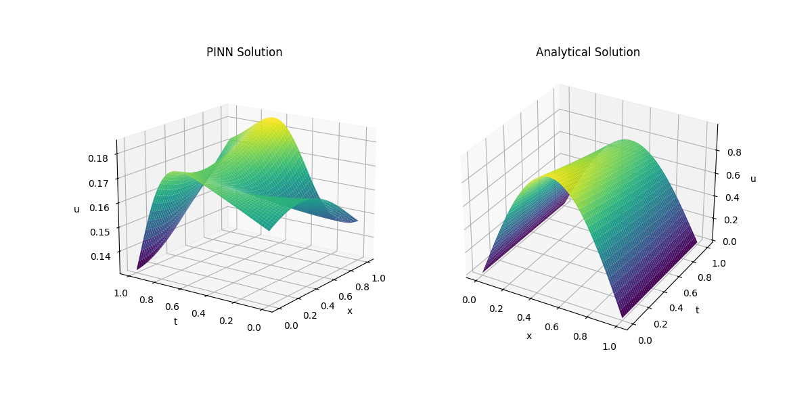
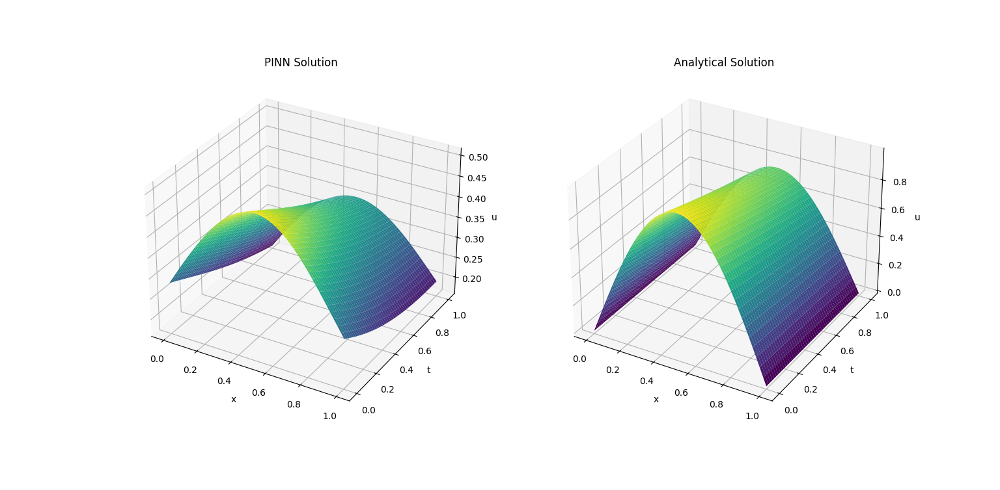
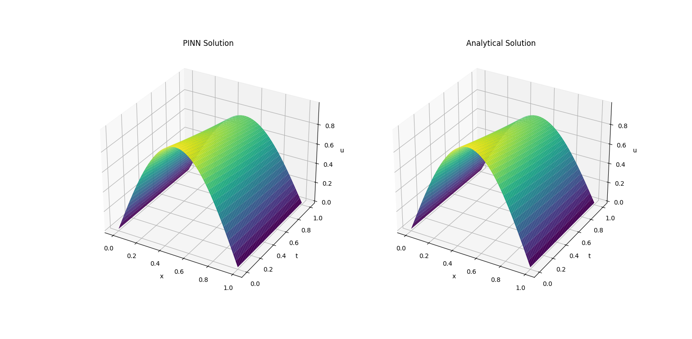

# Solving 1 dimensional heat equation under dirichlet conditions using Physics Informed Neural Networks

In this little experiment, i wanted to see how well a neural network, aided by the governing physics of the problem, could solve the 1D heat equation under dirichlet conditions. The heat equation is given by:

$$\frac{\partial u}{\partial t} = \alpha \frac{\partial^2 u}{\partial x^2}$$

where $u$ is the temperature, $t$ is time, $x$ is the spatial coordinate and $\alpha$ is the thermal diffusivity. The boundary conditions are given by:

$$u(0, t) = 0$$

$$u(1, t) = 1$$

$$u(x, 0) = sin(pi*x)$$

The domain of the problem is $x \in [0, 1]$ and $t \in [0, 1]$. The thermal diffusivity is set to 0.03. The analytical solution to this problem is given by:

$$u(x, t) = e^{-\pi^2 \alpha t} sin(\pi x)$$

The challenge for the neural network is to learn this solution without any prior knowledge of the analytical solution. The neural network is trained using the physics informed neural network (PINN) approach.

The implementation is honestly quite simple. I used a simple feedforward neural architecture with 3 hidden layers and 25 neurons per hidden layer. The only difference between this kind of PINN and a standard NN is the loss function, or rather the addition of the physics loss. In this problem, the physics loss can be broken down into 2 parts: the residual loss on the PDE and the loss on the boundary conditions.

# Results
Over 10000 epochs, the neural network was able to learn the analytical solution to the problem. The loss function decreased from 0.5 to 0.0001. The neural network was able to learn the solution to the problem without any prior knowledge of the analytical solution.
See for yourself:

